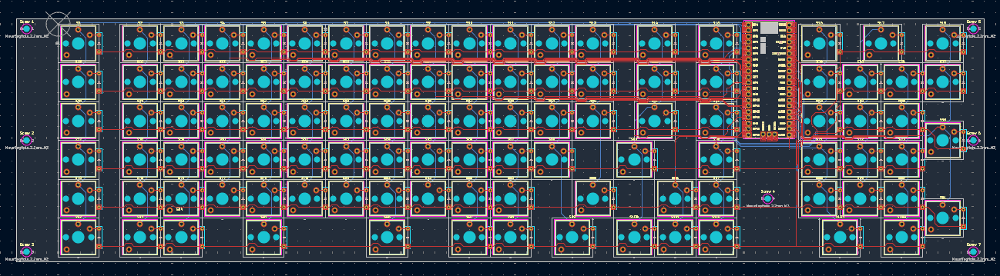
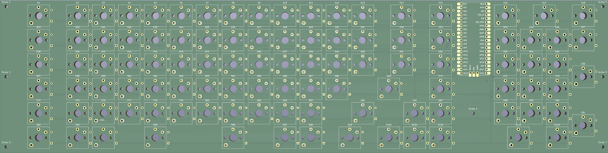
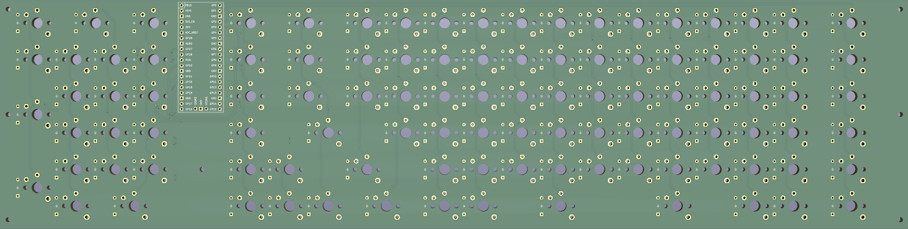
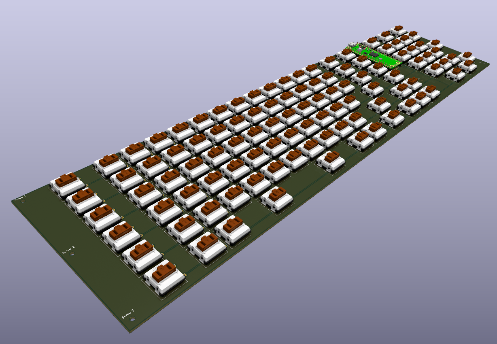

# Custom Mechanical Keyboard PCB

This project documents the design and development of a custom mechanical keyboard, including the keyboard layout, PCB design, component selection, and planned firmware implementation. The goal of the project is to design a functional custom keyboard from the electrical and mechanical design stage through PCB manufacturing, assembly, and testing.

## Project Overview

The keyboard was designed using Ergogen and KiCad, with a custom PCB layout created for Kailh Black Cloud switches. The PCB was ordered through JLCPCB and will be assembled using soldered diodes and hot-swappable switch sockets.

This project demonstrates practical experience with PCB design, electrical routing, mechanical layout constraints, design-for-manufacturing considerations, and embedded systems planning.

## Key Work

- Designed a custom keyboard layout using Ergogen.
- Created and refined the PCB in KiCad.
- Selected Kailh Black Cloud mechanical switches for the build.
- Ordered the custom PCB from JLCPCB for manufacturing.
- Designed the switch matrix and routing for the keyboard PCB.
- Planned assembly using soldered diodes and hot-swappable sockets.
- Considered mechanical constraints such as key spacing, stabilizer support, mounting holes, and case compatibility.

## Tools and Technologies

- Ergogen
- KiCad
- JLCPCB
- PCB design
- Keyboard switch matrix design
- Mechanical keyboard hardware
- Soldering
- Embedded firmware planning

## Images

### Keyboard Layout

### GPIO Pin Mapping

### Keyboard Matrix Schematic

### PCB Front View

### PCB Back View

### KiCad 3D View

## Current Status

The PCB design has been completed and ordered from JLCPCB. The next stage of the project is physical assembly and testing.

## Next Steps

- Solder the diodes onto the PCB.
- Solder the hot-swappable sockets onto the PCB.
- Install the switches and keycaps.
- Flash and configure keyboard firmware.
- Test the keyboard matrix for correct key detection.
- Debug any electrical or firmware issues.
- Design or finalize a case for the keyboard.

## Skills Demonstrated

- PCB layout and routing
- Design for manufacturing
- Electrical design constraints
- Component selection
- Mechanical layout planning
- Soldering and assembly
- Embedded systems workflow
- Technical documentation
